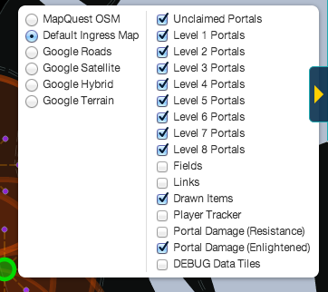
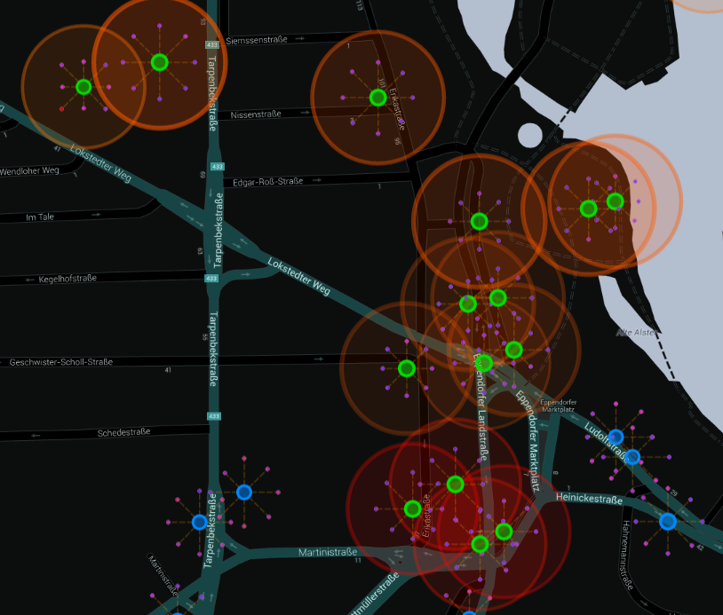

# IITC-Plugin: Portal-Damage

Visualizes Portal-Damage (zap-range, -intensity and mitigation) for all portals within view.

> __THIS IS A VERY EARLY ALPHA-RELEASE. DON'T EXPECT IT TO WORK PERFECTLY.__
> 
> It has only been tested in chrome with [tampermonkey][] and [IITC][] v0.12.2. 
> However, it should work. If you have any suggestions, requests or bugreports, 
> feel free to [file a bugreport][]…

## Screenshots

### Activate/Deactivate using the Layers-Menu

### Portal-Damage Visualization

The circles around the portals show the range within which you will get zapped, the color and opacity indicate the intensity of the zap – from red for "will hurt quite badly" (>1000XM per zap) to orange/yellow for "yeah, so what". The stroke-width of the circle indicates the portal's mitigation from shields and links.

## Installation

If you have tampermonkey installed, you might just want to [click here][download] and confirm the installation.
Otherwise you may [download][] the user-script ([sourcecode here][]) and do whatever pleases you most.

## Acknoledgements

Some people did awesome work I relied on, namely:

  * _Jon Atkins_ and all the folks that made IITC possible (and extensible)
  * _Kristian Köhntopp_ for doing the math (damage and mitigation-calculations are his). 

## License

### The MIT License (MIT)

_Copyright (c) 2013 Martin Schuhfuß_

Permission is hereby granted, free of charge, to any person obtaining a copy
of this software and associated documentation files (the "Software"), to deal
in the Software without restriction, including without limitation the rights
to use, copy, modify, merge, publish, distribute, sublicense, and/or sell
copies of the Software, and to permit persons to whom the Software is
furnished to do so, subject to the following conditions:

The above copyright notice and this permission notice shall be included in
all copies or substantial portions of the Software.

THE SOFTWARE IS PROVIDED "AS IS", WITHOUT WARRANTY OF ANY KIND, EXPRESS OR
IMPLIED, INCLUDING BUT NOT LIMITED TO THE WARRANTIES OF MERCHANTABILITY,
FITNESS FOR A PARTICULAR PURPOSE AND NONINFRINGEMENT. IN NO EVENT SHALL THE
AUTHORS OR COPYRIGHT HOLDERS BE LIABLE FOR ANY CLAIM, DAMAGES OR OTHER
LIABILITY, WHETHER IN AN ACTION OF CONTRACT, TORT OR OTHERWISE, ARISING FROM,
OUT OF OR IN CONNECTION WITH THE SOFTWARE OR THE USE OR OTHER DEALINGS IN
THE SOFTWARE.

[IITC]: http://iitc.jonatkins.com/
[tampermonkey]: https://chrome.google.com/webstore/detail/tampermonkey/dhdgffkkebhmkfjojejmpbldmpobfkfo
[file a bugreport]: https://github.com/usefulthink/iitc-portal-damage/issues/new
[download]: https://github.com/usefulthink/iitc-portal-damage/raw/master/build/portal-damage.user.js
[sourcecode here]: src/portal-damage.user.js
